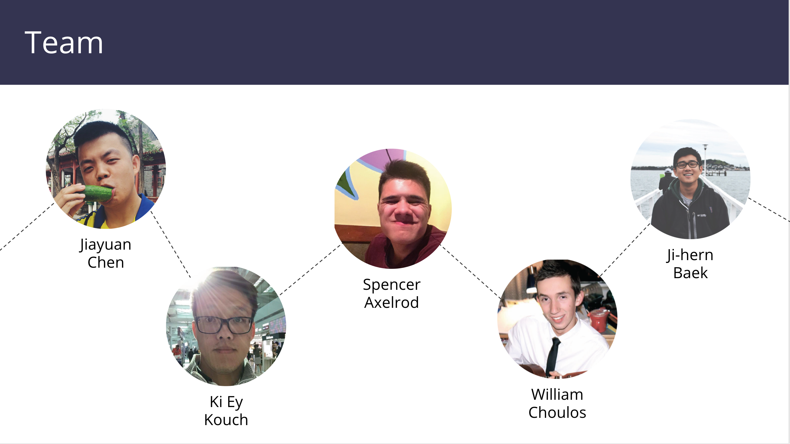
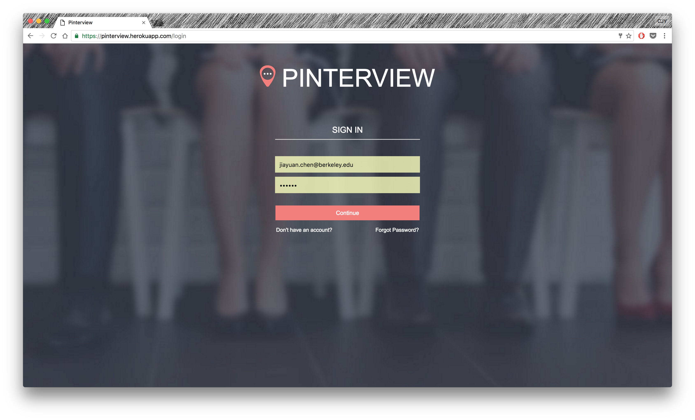
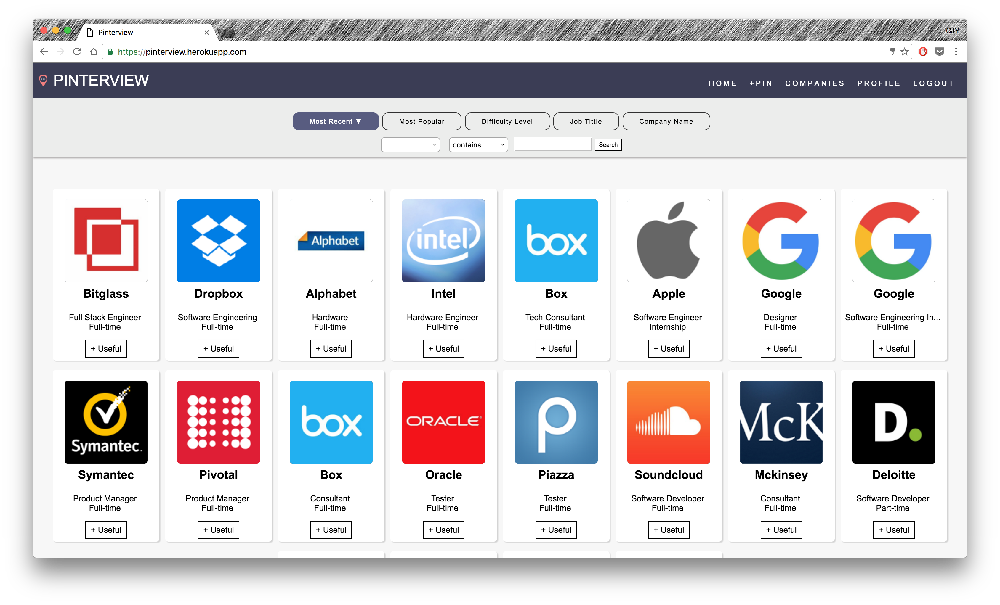
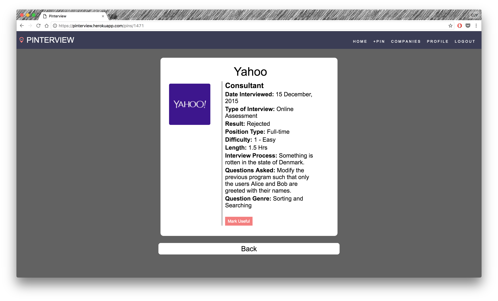
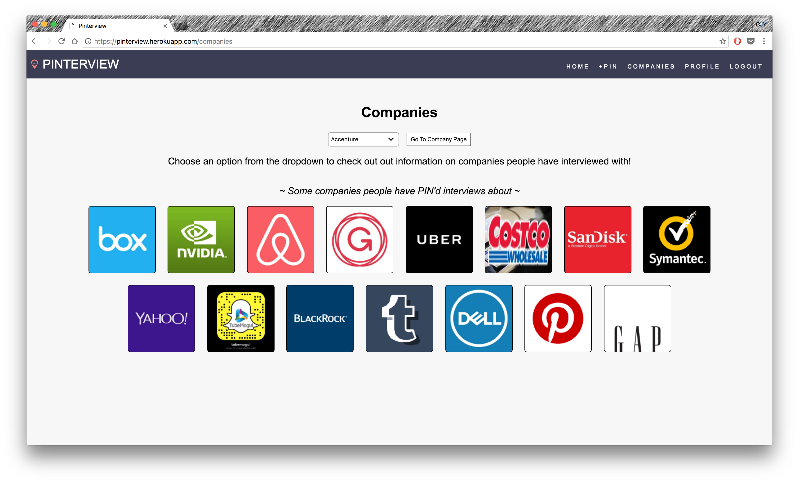
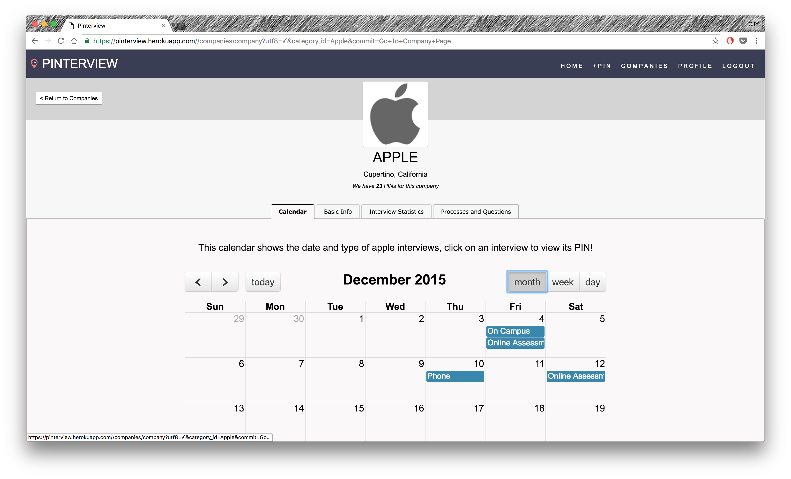
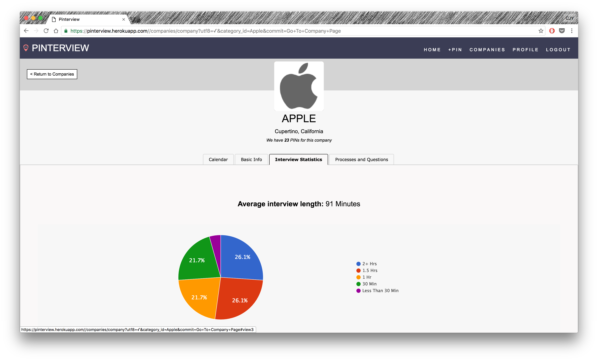
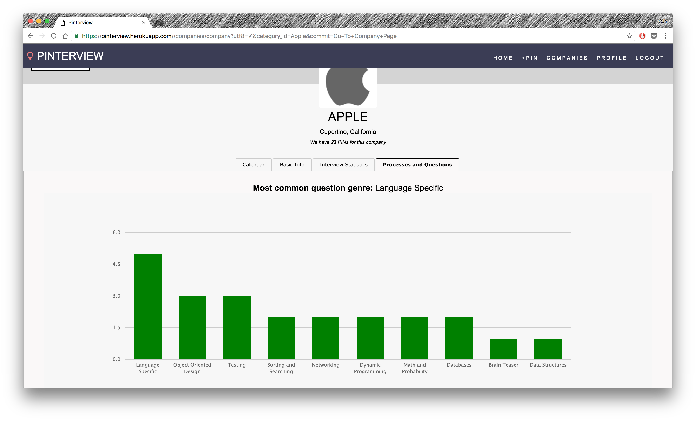

## README

## Run Application
To run the application, simply go to https://pinterview.herokuapp.com, or rails s on localhost.

## Testing
To run tests, run rspec on localhost, or spec spec/model/ for entire test in models folder.

Please feel free to use a different markup language if you do not plan to run `rake doc:app`.